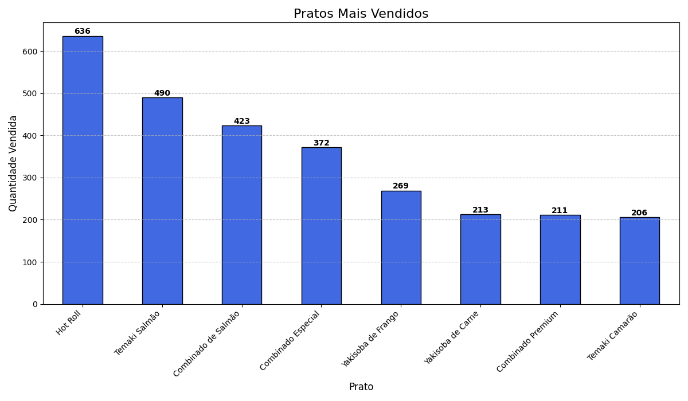
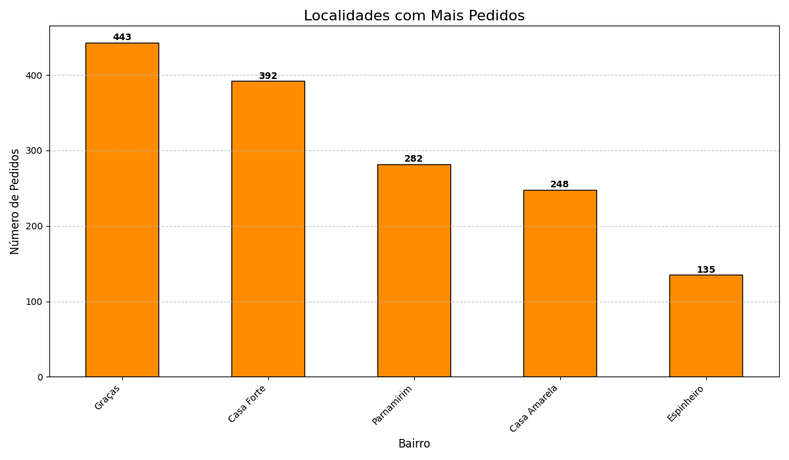
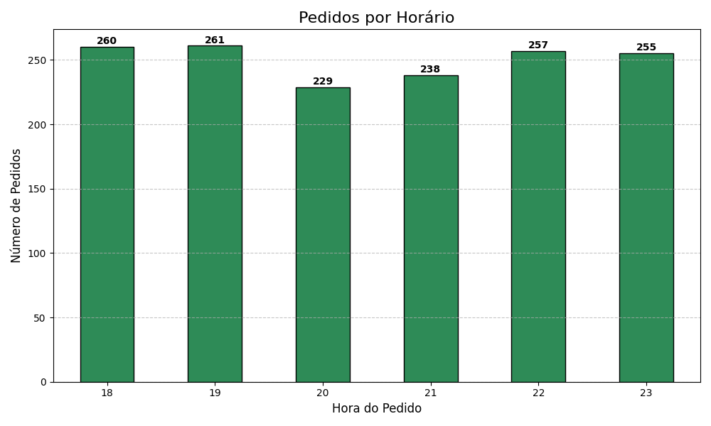

# Yellow House Sushi - Data Analysis

Análise exploratória e visualização dos dados de vendas do restaurante Yellow House Sushi.

---

## 📊 Visão Geral

Este projeto tem como objetivo extrair insights relevantes dos pedidos realizados no Yellow House Sushi, utilizando Python para análise de dados e geração de gráficos informativos.

---

## 🔍 Principais Análises

- **Pratos mais vendidos:**
	- Identificação dos pratos com maior volume de vendas.
- **Localidades com mais pedidos:**
	- Ranking dos bairros com maior número de pedidos.
- **Horários de pico:**
	- Descoberta dos horários com maior demanda de pedidos.
- **Resumo numérico:**
	- Top 5 pratos e bairros, totais de vendas e pedidos.

---

## 🛠️ Como Utilizar

1. Instale as dependências necessárias:
	 ```bash
	 pip install pandas matplotlib numpy
	 ```
2. Execute o script principal:
	 ```bash
	 python3 analise_dados.py
	 ```
3. Os gráficos serão gerados automaticamente na pasta do projeto:
	 - `pratos_mais_vendidos.png`
	 - `localidades_mais_pedidos.png`
	 - `pedidos_por_horario.png`

---

## 📈 Exemplos de Gráficos

### Pratos Mais Vendidos


### Localidades com Mais Pedidos


### Pedidos por Horário


---

## 💡 Possibilidades de Expansão

- Receita total por prato e bairro
- Tempo médio de espera por prato/bairro
- Tendências por dia da semana
- Ticket médio por pedido
- Mapa de calor de vendas por bairro (Power BI)
- Detecção de outliers em tempo de espera ou quantidade

---

## 📂 Estrutura dos Arquivos

- `analise_dados.py` — Script principal de análise e geração dos gráficos
- `dados_yellow_house_sushi.csv` — Base de dados dos pedidos

---

## 👤 Autor

PortelaDev
